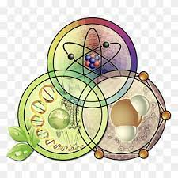

 Hi there 👋

- 🔭 I’m currently an undergraduate biomedical engineering student.
- 🌱 I’m currently learning some programming languages such as HTML & CSS, Python, JavaScript and C programming as skills.
- 👩‍🦰 I'm into research. My main research area is Quantum Chemistry.

- 👯 I’m looking forward to collaborating on any fun project and web development projects involving the programming languages I have mentioned above.
- 💬 Let's connect on [Linkedin](https://www.linkedin.com/in/nana-yaa-adomaa-doku-amponsah-078854235)
- 📫 How to reach me: Through my personal and active [Email](dokuamponsahnanayaaadomaa@gmail.com)
- 😄 Pronouns: She/Her
- ⚡ Fun fact: I am a very curious learner and always encourage myself by speaking to myself.
- 😌 Hobbies: I love reading and exploring outside my field of study.

